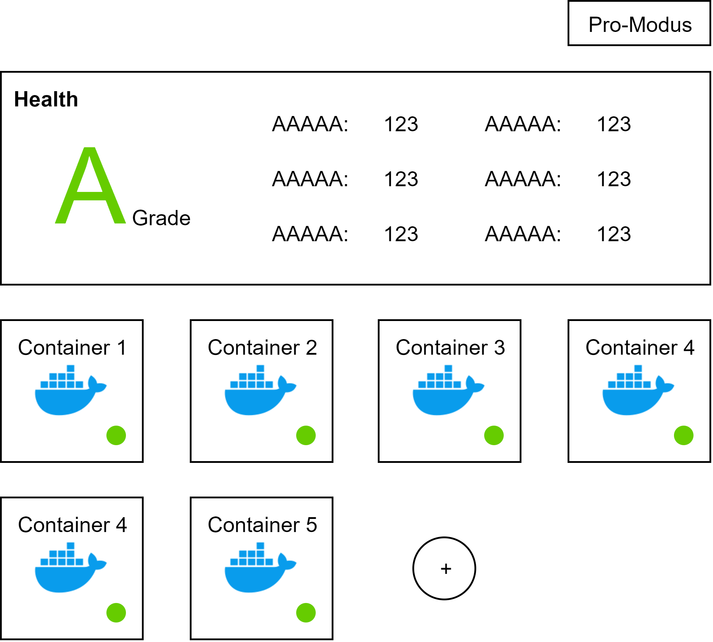
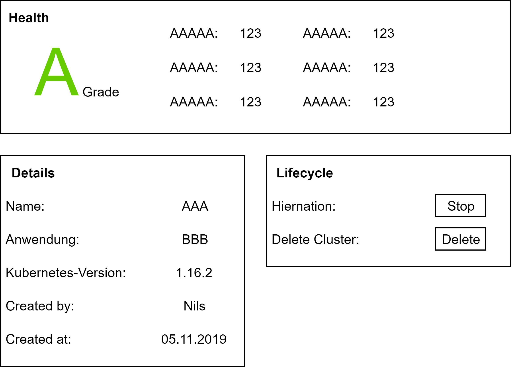

# Anforderungsanalyse
In modernen Infrastrukturen erlauben es containerbasierte Technologien, Anwendungen einfach zu verwalten und zu skalieren. Docker und Kubernetes haben sich als robuste Lösungen zur Erstellung und Verwaltung von containerbasierter Anwendungen bewährt. Für die Orchestration dieser Anwendung gibt es viele verschiedene Anwendungen, darunter Portainer.io, Rancher, Cockpit-Project oder Gardener. Diese Werkzeuge erlauben es, neue Container zu erzeugen und den Status des eigenen Clusters zu überwachen.

Die Oberflächen dieser Management-Werkzeuge werden hauptsächlich für Administratoren und technisch-versierte Anwender konzipiert. Sie bieten viele Möglichkeiten und einen detaillierten Einblick in den Gesundheitszustands des Systems.

Für fachfremde Nutzer, wie zum Beispiel Landwirte, sind die komplexen und vielen Möglichkeiten ungeeignet. Die Management-Werkzeuge bieten einen ungewollten Informationsüberfluss und erlauben es dem Benutzer nicht, seine containerbasierten Anwendungen auf eine einfache Art und Weise zu verwalten.
Eine korrekte und fehlerfreie Konfiguration und Verwaltung eines Clusters ist essentiell, um die Sicherheit und den Schutz der Daten zu gewährleisten. Verschiedene Anwendungen auf einer solchen Infrastruktur zu betreiben, bedarf eines großen technisches Wissens, welches viele Landwirte nicht besitzen. Daher muss es dem Landwirt auf eine einfache Art und Weise ermöglicht werden, in einem einheitlichen Prozess neue Anwendungen zu installieren und den Status seines aktuellen Clusters zu überwachen.

Ziel ist die Konzeption und Entwicklung einer solchen Orchestrationslösung, welche es fachfremden Anwendern ermöglicht, lokale und containerbasierte Anwendungen auf eigenen (Edge-)Servern zu betreiben und den Gesundheitsstatus des Clusters zu überwachen. Dabei steht vor allem die Benutzbarkeit durch nicht technisch-versierte Anwender im Fokus. Daher soll die Anwendung einfach und intuitiv zu bedienen sein und den Benutzer nicht mit technischen Details überfordern.

## Mock-Ups
**Übersichtsseite**

**Container/Pod Detailseite**

